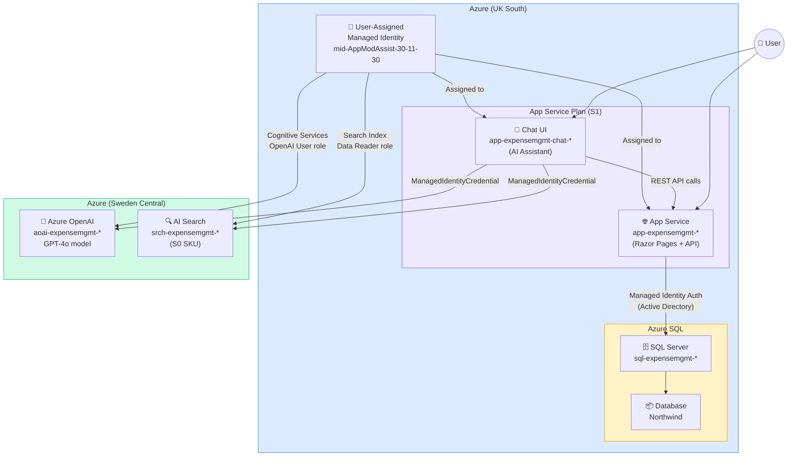

# Azure Services Architecture Diagram

## Expense Management System - Azure Services

## Service Connections Summary

| From | To | Auth Method | Purpose |
|------|----|-------------|---------|
| App Service | Azure SQL (Northwind) | Managed Identity (Active Directory) | CRUD operations via stored procedures |
| Chat UI | App Service APIs | Internal HTTP | Function calling for expense operations |
| Chat UI | Azure OpenAI (GPT-4o) | ManagedIdentityCredential | Natural language processing |
| Chat UI | AI Search | ManagedIdentityCredential | RAG document retrieval |

## Deployment Scripts

| Script | What it deploys |
|--------|----------------|
| `deploy.sh` | Resource Group → App Service → SQL → Schema → App Code |
| `deploy-with-chat.sh` | Everything in deploy.sh + Azure OpenAI + AI Search |

## Key Resources

| Resource | SKU | Region |
|----------|-----|--------|
| App Service Plan | S1 Standard | UK South |
| Azure SQL Database | Basic | UK South |
| Azure OpenAI | S0 | Sweden Central |
| AI Search | Basic | Sweden Central |
| Managed Identity | N/A | UK South |
